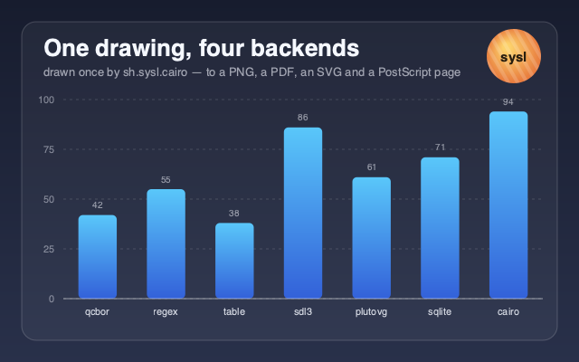

cairo-demo
==========

The worked example for [**cairo**](https://github.com/sysl-lang/cairo) — one drawing, four backends.



```
brew install cairo
sysl run . --link-path /opt/homebrew/lib
```

```
cairo 1.18.4
  wrote cairo-demo.png
  wrote cairo-demo.pdf
  wrote cairo-demo.svg
  wrote cairo-demo.ps
```

The point of it
---------------

`draw` is written once and never asks where it is going. It is called four times — onto pixels, onto
a PDF page, onto an SVG and onto a PostScript page — and **that is cairo's central idea**. A demo
that only wrote a PNG would be showing off the least interesting half of the library.

The picture above is `cairo-demo.png`. Open `cairo-demo.pdf` beside it and they are the same
drawing: the PNG has pixels in it and the PDF has curves, gradients and real text you can select.

```sysl
render(image_surface(Format.Argb32, 640, 400), "image")?
render(pdf_surface("out.pdf", WIDTH, HEIGHT), "PDF")?
render(svg_surface("out.svg", WIDTH, HEIGHT), "SVG")?
render(ps_surface("out.ps", WIDTH, HEIGHT), "PostScript")?
```

What it exercises
-----------------

Enough of the package to be worth reading, and nothing for its own sake:

- **Gradients** — a linear one for the background and one per bar, a radial one for the badge
- **Paths** — a rounded rectangle built from four arcs and a `close_path`, which is the routine every
  cairo program ends up writing
- **Dashes** — the gridlines, set and then unset
- **Text** — measured with `text_extents` and then centred or right-aligned on the measurement, which
  is the only way to place text that does not assume a font
- **A clip and a transform** — the badge's stripes are drawn straight, rotated, and cut to a circle,
  all inside one `save`/`restore` so nothing else has to know
- **Alpha** — the card is white at five per cent over the background, so it lifts rather than covers

No files
--------

There is no font file, no image, no data file. The numbers are in the source, the typeface is
whatever the system calls `"sans"`, and the only files touched are the four it writes. The whole
repository is a manifest, a licence, this page, one screenshot and 258 lines of sysl.

License
-------

[ISC](LICENSE)
